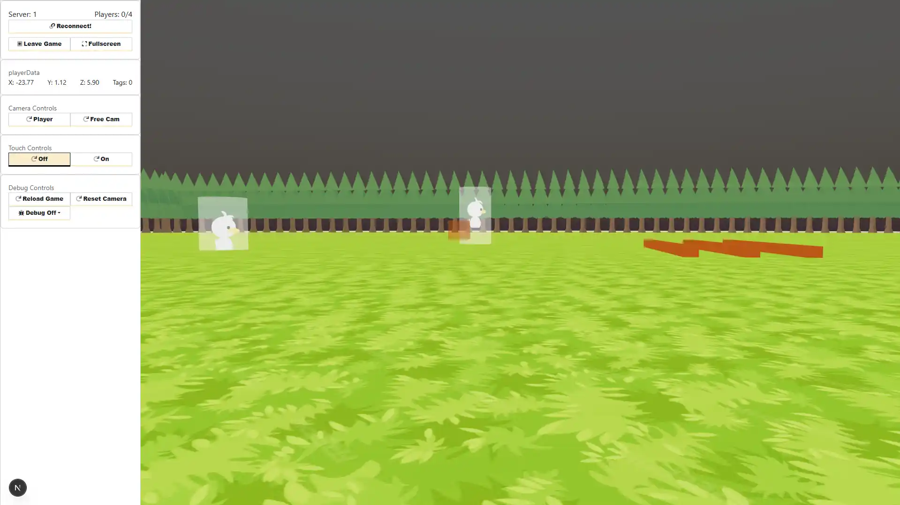

# Tag

Avoid other players and collect as much objects as possible, if you become tagged then you must tag someone else before you can collect objects again.



## Getting Started

First, run the development server:

```bash
npm run dev
```

## Multiplayer

Aiming to have multiplayer via P2P and Websockets. Websocket backend code is not in this repo or available at this time. P2P code will be included here.