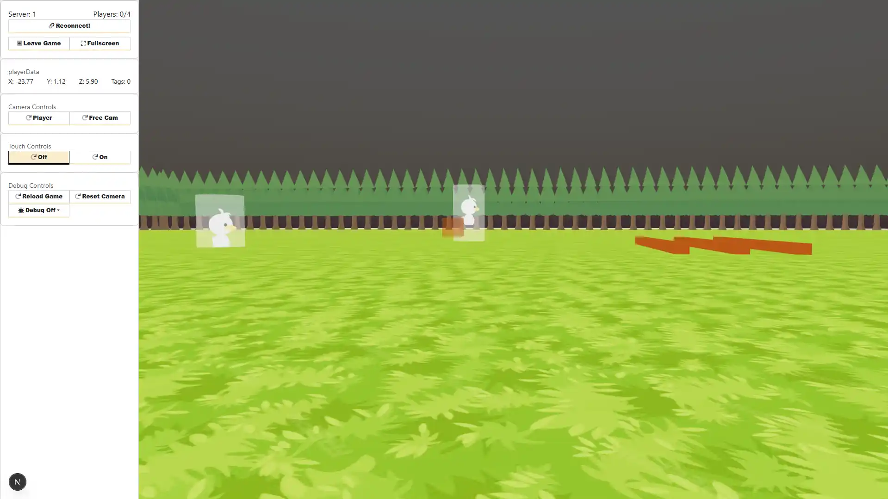
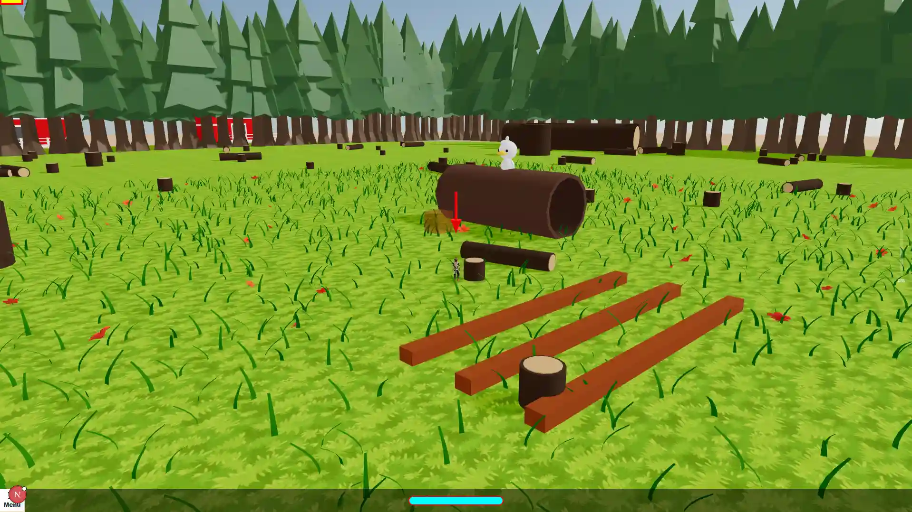
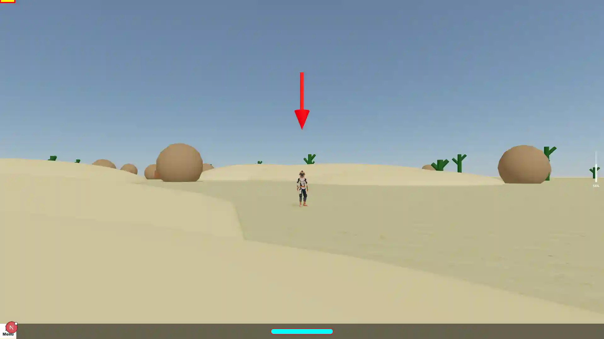
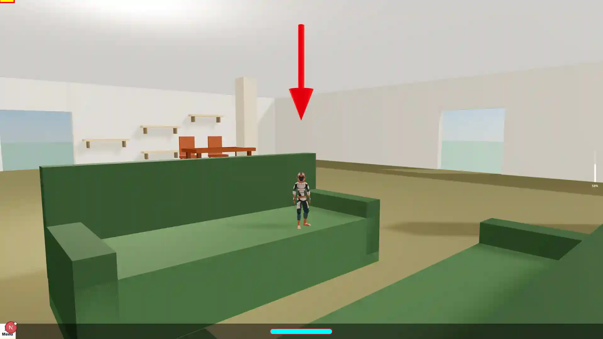

# Tag

Multiplayer Peer-to-peer tag game built with React Three Fiber and Next.js. Run, hide, and tag your friends in a fun and dynamic 3D environment. Join the chase and see if you can avoid being 'it' in this fast-paced game of tag!



## Getting Started

First you will need to setup a .env file from the .env.sample provided.

Then development server can be run:

```bash
npm run dev
```

## Scripts

In the scripts folder is reset_public and sync_to_s3. This is only for Articles Media usage. Allows for putting public folder to CloudFront to lower Vercel charges for the public facing site.

## Multiplayer

Multiplayer powered by WebRTC via PeerJS. Share your invite link or code once you are in a game.

## TODO

- Implement gamepad support

## Attributions

[Background music and sound effects](https://toontown.fandom.com/wiki/Music)  
[Hand graphic](https://www.flaticon.com/free-icon/hand_2775745)  
[Landing background](https://www.freepik.com/free-vector/blank-nature-park-landscape-daytime-scene-with-pathway-through-meadow_14801733.htm)
[Character Models - Quaternius](https://quaternius.com/packs/ultimatemodularcharacters.html)

## Map Previews


